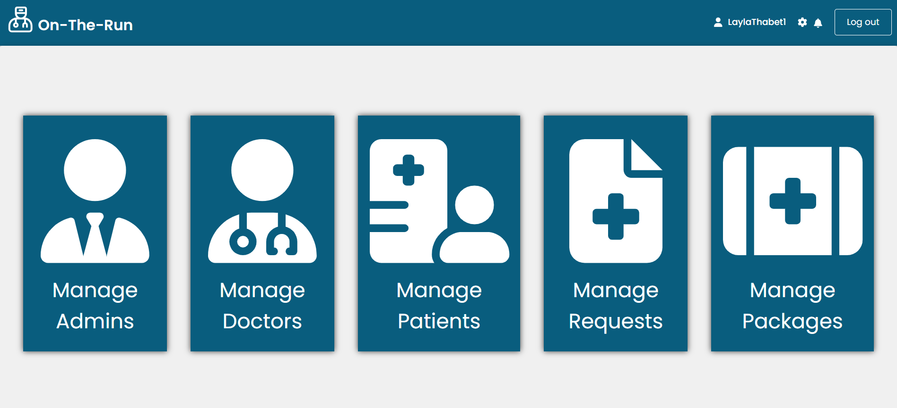
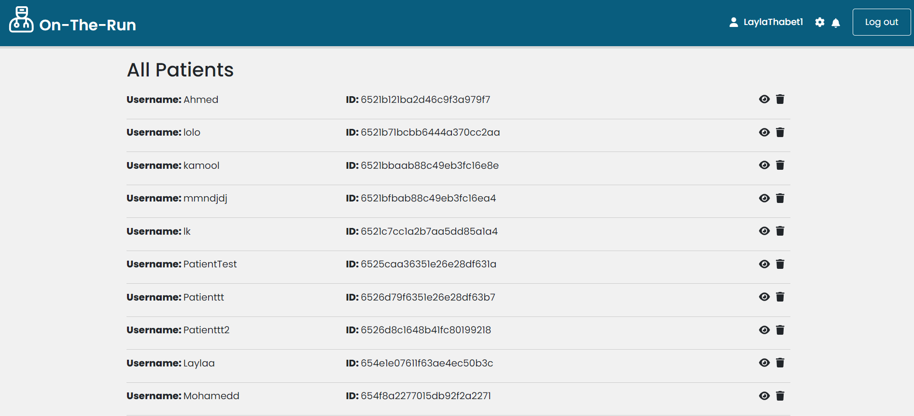
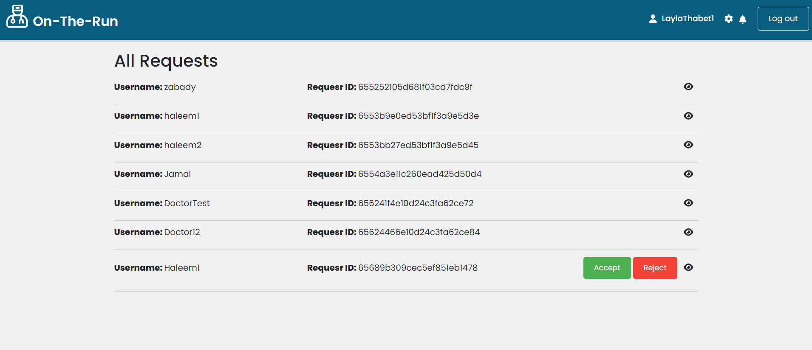
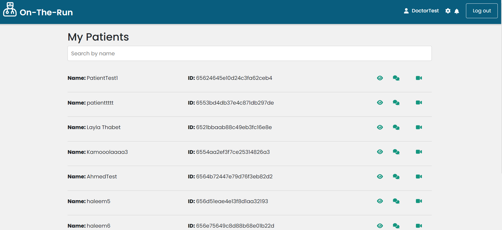
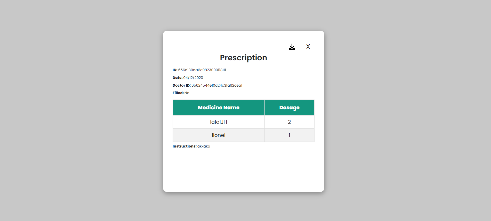

# On-The-Run-Clinic

## Summary

On-The-Run-Clinic is a web application that connects patients, doctors, and administrators for streamlined healthcare services. Patients can register, schedule appointments, manage prescriptions, and subscribe to health packages. Doctors benefit from an intuitive interface for managing appointments, prescriptions, and patient records. Administrators have tools for user management and health package configurations. The platform enhances healthcare interactions with secure authentication, video calls, and a wallet system for payments and refunds.

## Motivation

On-The-Run-Clinic is inspired by the pressing need to modernize and simplify healthcare services. Traditional healthcare systems often face challenges in communication, appointment management, and overall accessibility. The motivation behind this project is to bridge these gaps by providing a digital platform that connects patients, doctors, and administrators cohesively and efficiently.

The goal is to revolutionize the healthcare experience, ensuring that routine interactions, such as appointment scheduling, prescription management, and health package subscriptions, are user-friendly and secure. On-The-Run-Clinic seeks to empower patients with easy access to healthcare services, offer doctors intuitive tools for managing their practice, and provide administrators with the means to oversee and configure the platform effectively.

In summary, the motivation behind On-The-Run-Clinic is to create a modern and accessible healthcare platform that not only meets the current needs of patients and healthcare professionals but also anticipates and adapts to the evolving landscape of healthcare services. Through secure authentication, video calls, and a streamlined payment system, the project aims to enhance the overall quality and convenience of healthcare interactions.

## Performance Issues and Bugs

**Note**: The two websites (provide_website_1 and provide_website_2) are currently not linked. This is due to ongoing development efforts to establish the necessary connections and ensure a seamless experience between the platforms. We appreciate your patience and understanding as we work towards integrating these components. Updates on the linking progress will be communicated in subsequent releases.

- **Long Processing Time**: The website currently experiences delays in fetching information from MongoDB using Mongoose. Efforts are underway to optimize database queries and enhance overall performance.

Your understanding and patience as we address these issues are greatly appreciated.

## Code Style

The code follows React JavaScript coding conventions with the following notable aspects:

- **Import Statements:** Organized at the top of the file, each on a new line. External libraries are imported using a direct import statement (`import {...} from '...'`).

- **Component Definition:** Arrow function syntax is used for functional components with React hooks (`useState`, `useEffect`).

- **CSS Styling:** Inline styles are used within the JSX for styling components.

- **Variable Naming:** Generally clear and follows camelCase conventions.

- **Async/Await:** Asynchronous operations are handled using the `async/await` syntax.

- **Linking:** React Router's `Link` component is used for navigation.

- **Icons:** FontAwesome icons are used for visual elements.

If you're contributing to the project, please follow these conventions to maintain code consistency.

## Screenshots

Here are some screenshots that showcase how On-The-Run-Clinic looks and works:

*Admin Dashboard*

*Admin viewing and deleting patients page*

*Admin viewing doctor requests*

*Doctor viewing his patients and can videoCall them and chat*

*Patient adding a family member*

*Patient viewing his prescription*
