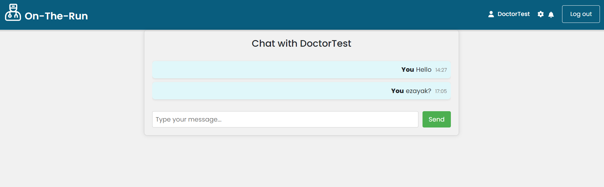

# On-The-Run-Clinic

## Summary

On-The-Run-Clinic is a web application that connects patients, doctors, and administrators for streamlined healthcare services. Patients can register, schedule appointments, manage prescriptions, and subscribe to health packages. Doctors benefit from an intuitive interface for managing appointments, prescriptions, and patient records. Administrators have tools for user management and health package configurations. The platform enhances healthcare interactions with secure authentication, video calls, and a wallet system for payments and refunds.

## Motivation

On-The-Run-Clinic is inspired by the pressing need to modernize and simplify healthcare services. Traditional healthcare systems often face challenges in communication, appointment management, and overall accessibility. The motivation behind this project is to bridge these gaps by providing a digital platform that connects patients, doctors, and administrators cohesively and efficiently.

The goal is to revolutionize the healthcare experience, ensuring that routine interactions, such as appointment scheduling, prescription management, and health package subscriptions, are user-friendly and secure. On-The-Run-Clinic seeks to empower patients with easy access to healthcare services, offer doctors intuitive tools for managing their practice, and provide administrators with the means to oversee and configure the platform effectively.

In summary, the motivation behind On-The-Run-Clinic is to create a modern and accessible healthcare platform that not only meets the current needs of patients and healthcare professionals but also anticipates and adapts to the evolving landscape of healthcare services. Through secure authentication, video calls, and a streamlined payment system, the project aims to enhance the overall quality and convenience of healthcare interactions.

## Performance Issues and Bugs

**Note**: The two websites (provide_website_1 and provide_website_2) are currently not linked. This is due to ongoing development efforts to establish the necessary connections and ensure a seamless experience between the platforms. We appreciate your patience and understanding as we work towards integrating these components. Updates on the linking progress will be communicated in subsequent releases.

- **Long Processing Time**: The website currently experiences delays in fetching information from MongoDB using Mongoose. Efforts are underway to optimize database queries and enhance overall performance.

Your understanding and patience as we address these issues are greatly appreciated.

## Code Style

The code follows React JavaScript coding conventions with the following notable aspects:

- **Import Statements:** Organized at the top of the file, each on a new line. External libraries are imported using a direct import statement (`import {...} from '...'`).

- **Component Definition:** Arrow function syntax is used for functional components with React hooks (`useState`, `useEffect`).

- **CSS Styling:** Inline styles are used within the JSX for styling components.

- **Variable Naming:** Generally clear and follows camelCase conventions.

- **Async/Await:** Asynchronous operations are handled using the `async/await` syntax.

- **Linking:** React Router's `Link` component is used for navigation.

- **Icons:** FontAwesome icons are used for visual elements.

If you're contributing to the project, please follow these conventions to maintain code consistency.

## Screenshots

Here are some screenshots that showcase how On-The-Run-Clinic looks and works:


*Admin Dashboard*


*Admin viewing and deleting patients page*


*Admin viewing doctor requests*


*Doctor viewing his patients and can videoCall them and chat*


*Chatting with patients*


*Patient viewing his prescription*


## Tech/Framework Used

The On-The-Run-Clinic project is built using the following technologies and frameworks:

- **React:** The frontend of the application is developed using the React library, providing a dynamic and responsive user interface.

- **Node.js:** The backend is powered by Node.js, ensuring efficient server-side processing and communication.

- **MongoDB:** As a NoSQL database, MongoDB is used to store and manage the project's data, providing scalability and flexibility.

- **Express:** The application utilizes the Express framework for building robust and scalable server-side applications.

- **Stripe:** For secure online payment processing, the Stripe API is integrated to handle credit card transactions.

- **FontAwesome:** Icons used in the user interface are sourced from FontAwesome, adding visual elements to the design.

- **Axios:** The Axios library is employed for making HTTP requests, ensuring seamless communication between the frontend and backend.

- **React Router:** Navigation within the React-based application is managed using React Router, providing a single-page application experience.

## Features

On-The-Run-Clinic boasts a range of features designed to enhance the healthcare experience for both patients and healthcare professionals. Here are some of the key features:

1. **User-Friendly Registration:**
   - Patients and doctors can easily register on the platform with a seamless registration process, providing essential details for a personalized experience.

2. **Document Upload for Medical History:**
   - Patients have the ability to upload and remove documents (PDF, JPEG, JPG, PNG) for their medical history, ensuring comprehensive and centralized record-keeping.

3. **Flexible Health Package Subscriptions:**
   - Patients can choose from different health packages (Silver, Gold, Platinum) with varying benefits, including session discounts, medication discounts, and family member subscription discounts.

4. **Secure Authentication and Password Management:**
   - Robust password validation ensures secure authentication, and users have the ability to change and reset passwords with ease.

5. **Comprehensive Appointment Management:**
   - Patients can filter, schedule, reschedule, and cancel appointments, while doctors can manage their available time slots and view upcoming appointments.

6. **Real-Time Video Calls:**
   - Doctors and patients can initiate video calls, providing a convenient and secure means of communication for consultations.

7. **Wallet System for Payments and Refunds:**
   - Patients can choose to pay for appointments and health packages using their wallet or credit card, and refunds are seamlessly processed to the user's wallet.

8. **Family Member Management:**
   - Patients can add and manage family members, allowing for streamlined health management for the entire family unit.

9. **Prescription and Medication Management:**
   - Doctors can add prescriptions, update dosages, and manage medications directly from the platform, providing a comprehensive overview for patients.

10. **Interactive Chat System:**
    - Doctors and patients can engage in secure and interactive chat sessions, fostering communication and clarification on healthcare matters.

These features collectively contribute to a user-centric healthcare platform, providing convenience, security, and efficiency in managing healthcare interactions. On-The-Run-Clinic aims to stand out by offering a holistic set of features that cater to the diverse needs of both patients and healthcare professionals.


## Code Examples

### Admin adding, deleting, and updating a health package
Adding a health package involves sending a POST request to the server with necessary package details.

```javascript
//admin viewing,deleting and updating the health packages
const ManageHealthPackages = () => {

  const [isFormVisible, setIsFormVisible] = useState(false);
  const [packages, setPackages] = useState([]);
  const [packagee, setPackagee] = useState("");
  const [activeId, setActiveId] = useState(null);
  const [isModalOpen, setIsModalOpen] = useState(false);

  useEffect(() => {
    // Fetch the list of health packages from the server
    axios.get('http://localhost:4000/getPackages', {
      withCredentials: true
    })
      .then((response) => {
        setPackages(response.data);
      })
      .catch((error) => {
        console.error('Error fetching health packages:', error);
      });
  }, []);

  const handlePackagesFetched = (isLinked) => {
    if (isLinked) {
      axios.get('http://localhost:4000/getPackages', {
        withCredentials: true
      })
        .then((response) => {
          setPackages(response.data);
        })
        .catch((error) => {
          console.error('Error fetching health packages:', error);
        });
      setIsFormVisible(false);
    }
  };
  const handleDelete = (packageId) => {
    // Send a DELETE request to delete the selected package
    axios.delete(`http://localhost:4000/deletePackage?id=${packageId}`, {
      withCredentials: true
    })
      .then((response) => {
        console.log('Package deleted successfully:', response.data);
        // Fetch the updated list of health packages after deletion
        axios.get('http://localhost:4000/getPackages', {
          withCredentials: true
        })
          .then((response) => {
            setPackages(response.data);
          })
          .catch((error) => {
            console.error('Error fetching health packages:', error);
          });
      })
      .catch((error) => {
        console.error('Error deleting health package:', error);
      });
  };


  return (
    <div className="container">
      <div className="prescriptions-list">
        <h2>
          Health Packages
          <FontAwesomeIcon
            className="add-icon"
            icon={faPlus}
            onClick={() => setIsFormVisible(true)}
            style={{ color: '#14967f' }}
          />
        </h2>
        <ul>
          {packages.map((p) => (
            <li key={p._id}>
              <div className="prescription-card">
                <div className="prescription-header" style={{ display: 'flex', justifyContent: 'space-between' }}>
                  <span><strong>Name: </strong>  {p.name}</span>
                  <div>
                    <FontAwesomeIcon
                      className="view-icon"
                      icon={faEye}
                      style={{marginRight:'10px'}}
                      onClick={() => {
                        setActiveId(p._id)
                        setPackagee(p);
                        setIsModalOpen(true);
                      }}
                    />
                    <FontAwesomeIcon
                      className="delete-icon"
                      icon={faTrash}
                      onClick={() => handleDelete(p._id)}
                    />
                  </div>
                </div>
                  <div><strong>Package ID: </strong> {p._id}</div>
                </div>
            </li>
          ))}
        </ul>
      </div>
      <div className="prescription-form">
        {isFormVisible && <HealthPackagesForm onPackagesFetched={handlePackagesFetched} />}
      </div>
      {isModalOpen && packagee &&
        <PackageDetailsModal
          setOpenModal={setIsModalOpen}
          packagee={packagee}
          onSuccess={handlePackagesFetched}
        />
      }

    </div>

  )
}
export default ManageHealthPackages
```

### User Login and Logout
Logging in and out involves sending a POST request to the server with the necessary user details.
A token is being created when logging in and it is being deleted when logging out.
```javascript

// create json web token
const maxAge = 3 * 24 * 60 * 60;
const createToken = (username,role) => {
    return jwt.sign({ user:username,role }, 'supersecret', {
        expiresIn: maxAge
    });
};


const login = async (req, res) => {
  const { username, password } = req.body;
  try {
      let user = await Patient.findOne({ username });
      let role="patient"
      if(!user){
          user = await Doctor.findOne({ username });
          role="doctor"
      }
      if(!user){
          user = await Admin.findOne({ username });
          role="admin"
      }
      if(!user){
        user = await Pending.findOne({ username });
        role="pending"
    }

      if(!user){
          return res.status(404).json({ error: "Username doesn't exist" });
      }
      let auth=false;
      if(role==="pending"){
        auth=(password===user.password)
      }
      else{
        auth = await bcrypt.compare(password, user.password);
      }

    

     
      if (auth) {
        const token = createToken(user.username,role);
        console.log(token);
        res.cookie('jwt', token, { httpOnly: true, maxAge: maxAge * 1000, secure: false });
        res.status(200).json({ user: user.username, role: role, token: token });
    } else {
        res.status(401).json({ error: 'Incorrect password' });
    }
  } catch (error) {
      res.status(500).json({ error: error.message });
  }
}

const logout = async (req, res) => {
    res.cookie('jwt', '', { maxAge: 1 });
    res.status(200).json({ message: 'User logged out' });
}

const transporter = nodemailer.createTransport({
    service: 'gmail', // Example: 'Gmail'
    auth: {
      user: 'ontherunclinic@gmail.com',
      pass: 'wkdy hbkz loda mebe',
    },
  });
  
  // Generate and store OTP
  const generateOTP = () => {
    return crypto.randomInt(1000, 9999).toString();
  };
  
  // Send OTP via email
  const sendOTPByEmail = async (email, otp) => {
    try {
      const mailOptions = {
        from: 'ontherunclinic@hotmail.com',
        to: email,
        subject: 'Password Reset OTP',
        text: `Your OTP for password reset is: ${otp}`,
      };
      await transporter.sendMail(mailOptions);
    } catch (error) {
      console.error('Error sending OTP email:', error);
    }
  };
  
  // Route to initiate password reset
  const forgetPassword= async (req, res) => {
    const { username,email } = req.body;
 
    try {
      let user = await Patient.findOne({ username });
      if (!user) {
         user = await Doctor.findOne({ username });
      }
      if (!user) {
         user = await Admin.findOne({ username });
      }
      if (!user) {
        return res.status(404).json({ message: "Username doesn't exist" });
      }
     
  
      // Generate and store OTP
      const otp = generateOTP();
      
      user.passwordReset = otp;
  
      // Save user with OTP
      await user.save();
  
      // Send OTP via email
      await sendOTPByEmail(email, otp);
  
      return res.status(200).json({ message: 'Check your email for the OTP.' });
    } catch (error) {
      console.error('Error initiating password reset:', error);
      res.status(500).json({ message: 'Server error' });
    }
  };
  
  // Route to reset the password
  const resetPassword= async (req, res) => {
    const { username } = req.params;
    const {otp, newPassword } = req.body;
    try {
      let user = await Patient.findOne({ username });
      if (!user) {
         user = await Doctor.findOne({ username });
      }
      if (!user) {
         user = await Admin.findOne({ username });
      }
      if (!user) {
        return res.status(404).json({ message: 'User not found' });
      }
  
  
      
  
  
      if (user.passwordReset!== otp) {
        return res.status(400).json({ message: 'Invalid OTP' });
      }
  
      // Update password
      const salt = await bcrypt.genSalt(10);
      const hashedPassword = await bcrypt.hash(newPassword, salt);
  
      if(user = await Patient.findOne({ username })){
        await Patient.updateOne(
          {
            username: username,
          },
          {
            $set: {
              password: hashedPassword,
              passwordReset: undefined,
            },
          }
        );
        await user.save();
      }
      if(user = await Doctor.findOne({ username })){
        await Doctor.updateOne(
          {
            username: username,
          },
          {
            $set: {
              password: hashedPassword,
              passwordReset: undefined,   // Clear the password reset data
            },
          }
        );
        await user.save();
      }
      if(user = await Admin.findOne({ username })){
        await Admin.updateOne(
          {
            username: username,
          },
          {
            $set: {
              password: hashedPassword,
              passwordReset: undefined,   // Clear the password reset data
            },
          }
        );
        await user.save();
      }
  
      
  
      // Save the updated user
     
  
      return res.status(200).json({ message: 'Password reset successfully.' });
    } catch (error) {
      console.error('Error resetting password:', error);
      res.status(500).json({ message: 'Server error' });
    }
  };


module.exports = { logout, login, forgetPassword, resetPassword };
```
## Installation
 ### prerequisites
   1. **Node.js and npm:**
     - Ensure you have Node.js installed on your machine. You can download it [here](https://nodejs.org/).

   2. **MongoDB:**
     -[here](https://www.mongodb.com/).
   3. **Git:**
     -[here](https://git-scm.com/).

### Clone the Repo
  ```bash
 git  https://github.com/advanced-computer-lab-2023/On-The-Run-Clinic.git
```
#### To run the backend:
```bash
cd backend
npm run dev
```
#### To run the frontend:
```bash
cd frontend
npm start
```
## API Reference
```javascript
app.post("/createCrossMessage",createCrossMessage)
app.get("/getCrossChatMessages/:username/:doctor",getCrossChatMessages)
app.post("/sendCrossMessageAsDoctor",sendCrossMessageAsDoctor)
app.post("/createMessage",createMessage)
app.get("/getChatMessages/:username/:doctor",getChatMessages)
app.post("/sendMessageAsDoctor",sendMessageAsDoctor)
app.post("/sendMessageAsPatient",sendMessageAsPatient)
app.post("/createAdmin",requireAuthAdmin,createAdmin);
app.post("/register/doctor",requireAuthPending,createDoctor);
app.put("/updateDoctor",requireAuthDoctor,updateDoctor);
app.post("/register/patient",createPatient);
app.get("/getDocPatients/:username",requireAuth, getDocPatients);
app.get("/getDoctors",getDoctors);//removed
app.get("/getPatients",getPatients);//removed
app.get("/getAdmins",requireAuthAdmin,getAdmins)
app.post("/addFamilyMember",requireAuthPatient, createMember);
app.delete("/deleteDoctor/:id",requireAuthAdmin,deleteDoctor);
app.patch("/ubdateDoctor",updateDoctor);
app.get("/getFamilyMem/:username",requireAuth,getFamilyMembers);
app.get("/searchPatientsByName",requireAuth,searchPatientsByName);
app.post("/addPatientToDr",requireAuth,addPatientToDr);
app.post("/addPrescription",createPrescription);
app.get("/getPrescriptions/:id",requireAuth,getPrescriptionsForPatient);
app.get("/getMyPrescriptions/:username",requireAuth,getMyPrescriptions);
app.get("/getMyPrescriptions2/:username/:usernameDoctor",requireAuth,getMyPrescriptions2);
app.post("/createRequest",createRequest);
app.post("/createPackage",createHealthPackage);
app.get("/getPackages",requireAuth,getPackages);
app.put("/updatePackage",requireAuthAdmin,updateHealthPackage);
app.delete("/deletePackage",requireAuthAdmin,deleteHealthPackage);
app.delete("/deleteAdmin/:id",requireAuthAdmin,deleteAdmin);
app.delete("/deletePatient/:id",requireAuthAdmin,deletePatient);
app.get("/getDoctor/:username",getDoctorByUsername);//removed
app.get("/getOneRequest",getOneRequest);
app.get("/getRequests",requireAuthAdmin,getRequests);
app.post("/createAppointment",createAppointment);//removed
app.get("/getAllAppointments",requireAuth,getAllAppointments);
app.get("/filterAppointments",requireAuth,filter);
app.get("/search/:username",requireAuth,searchPatientsByUserame);
app.get("/getDoctorAppointments/:id",requireAuth,getDoctorAppointments);
```

## Tests

The On-The-Run-Clinic project includes a set of tests to ensure the reliability and functionality of its features. Postman was used for testing the API endpoints.

### Running Tests

To run the tests, follow these steps:

1. **Install Postman:**
   - If you don't have Postman installed, download and install it from [Postman's official website](https://www.postman.com/).

2. **Test every endpoint:**
   - run tests to ensure that the endpoint is working.


### Test Scenarios

The tests cover various scenarios, including:

- Authentication and Authorization checks.
- Endpoint validations for input and output.
- Handling of edge cases and error responses.

### Important Notes

- Make sure the server is running locally or on a reachable environment before running the tests.
- Update the environment variables in Postman if necessary, such as the base URL.

## How to Use

On-The-Run-Clinic is designed to be user-friendly, providing an intuitive interface for patients, doctors, and administrators. Follow the steps below to make the most of the application:

### Patient

1. **Registration:**
   - Start by registering as a patient using the provided registration form.
   - Fill in your details and submit the form to create an account.

2. **Login:**
   - Once registered, log in using your credentials.

3. **Dashboard:**
   - Explore your personalized dashboard where you can manage appointments, prescriptions, and family members.

4. **Appointments:**
   - Schedule, reschedule, or cancel appointments based on your availability and needs.

5. **Health Packages:**
   - Browse and subscribe to health packages that offer various benefits and discounts.

6. **Medical History:**
   - Upload and manage your medical history documents for comprehensive record-keeping.

7. **Wallet:**
   - Monitor your wallet balance for convenient payments and refunds.

8. **Communication:**
   - Engage in secure video calls, chats, and follow-up requests with your assigned doctor.

### Doctor

1. **Registration:**
   - Doctors can register with their details, including speciality.

2. **Login:**
   - Access the platform using your registered credentials.

3. **Dashboard:**
   - Navigate the dashboard to manage appointments, prescriptions, and patient interactions.

4. **Appointments:**
   - View and manage your appointment schedule, accepting or rejecting patient requests.

5. **Prescriptions:**
   - Add, update, and manage prescriptions for your patients directly from the platform.

6. **Communication:**
   - Initiate and participate in secure video calls and chats with patients.

### Administrator


1. **Login:**
   - Log in using the administrator account.

2. **Dashboard:**
   - Access tools for user management, health package configurations, and system settings.

3. **User Management:**
   - Manage doctors, patients, and other administrators effectively.

4. **Health Packages:**
   - Add, update, or remove health packages available to patients.


### General Tips

- **Authentication:**
  - Ensure secure and unique passwords for your account.
  - Use two-factor authentication for an additional layer of security.


Feel free to explore the features and functionalities of On-The-Run-Clinic to enhance your healthcare experience.
 ## Contribute

Thank you for considering contributing to On-The-Run-Clinic! We welcome contributions from the community to help improve and enhance the platform. Whether you're a developer, designer, or enthusiast, your input is valuable.

### Development Guidelines

- Follow the established code style and conventions outlined in the [Code Style](#code-style) section.

- Document your code changes thoroughly, especially for new features or significant modifications.

- Write clear and concise commit messages.

### Reporting Issues

If you encounter any bugs, issues, or have suggestions for improvements, please open an issue on the GitHub repository. Provide detailed information to help us understand and address the problem.

### Feature Requests

If you have ideas for new features or improvements, feel free to open an issue to discuss and propose your suggestions.

Thank you for contributing to On-The-Run-Clinic! Your efforts help make healthcare services more accessible and efficient.

## Credits

We would like to express our gratitude to the following individuals and resources that have contributed to the development and learning process of On-The-Run-Clinic:

### YouTube Channels

- [Traversy Media](https://www.youtube.com/channel/UC29ju8bIPH5as8OGnQzwJyA)
- [Academind](https://www.youtube.com/channel/UCW5YeuERMmlnqo4oq8vwUpg)

### Node.js

- [Node.js Documentation](https://nodejs.org/)

### Tutorials and Playlists

- [Node.js Crash Course](https://www.youtube.com/playlist?list=PLZlA0Gpn_vH_uZs4vJMIhcinABSTUH2bY)
- [Express.js Crash Course](https://www.youtube.com/watch?v=fgTGADljAeg)
- [React Introduction](https://www.youtube.com/playlist?list=PLZlA0Gpn_vH_NT5zPVp18nGe_W9LqBDQK)
- [React Hooks - Functional Components](https://www.youtube.com/playlist?list=PLZlA0Gpn_vH8EtggFGERCwMY5u5hOjf-h)
- [React Hooks Tutorial](https://youtu.be/hQAHSlTtcmY)
- [useState vs useEffect](https://codedamn.com/news/reactjs/usestate-and-useeffect-hooks)

### JWT Authentication

- [JWT Authentication Tutorial](https://www.youtube.com/watch?v=mbsmsi7l3r4)
- [JWT Authentication in Node.js](https://www.youtube.com/watch?v=-RCnNyD0L-s)
- [MERN Stack Authentication Tutorial](https://dev.to/salarc123/mern-stack-authentication-tutorial-part-1-the-backend-1c57)

### Using Stripe for Payment Process

- [Stripe API Tutorial](https://youtu.be/1r-F3FIONl8)


## License

This project is licensed under the [MIT License](https://opensource.org/licenses/MIT)

### Third-Party Licenses

Certain components and dependencies used in this project are subject to their own licenses:

- *Stripe:* The use of Stripe is subject to the [Apache License 2.0](https://www.apache.org/licenses/LICENSE-2.0). Please review the license terms for more information.

- *MongoDB:* The use of MongoDB is subject to the [Server Side Public License (SSPL)](https://www.mongodb.com/licensing/server-side-public-license). Please review the license terms for more information.

- *nodemon:* The use of nodemon is subject to the [MIT License](https://opensource.org/licenses/MIT). Please review the license terms for more information.

- *Bootstrap:* The use of Bootstrap is subject to the [MIT License](https://opensource.org/licenses/MIT). Please review the license terms for more information.

- *JWT Authentication:* The specific implementation or library used for JWT authentication is subject to its own license. Please review the license terms for more information.

Refer to the respective licenses of these components for details about permissions and restrictions. Ensure compliance with the terms of each license when using or contributing to this project.

